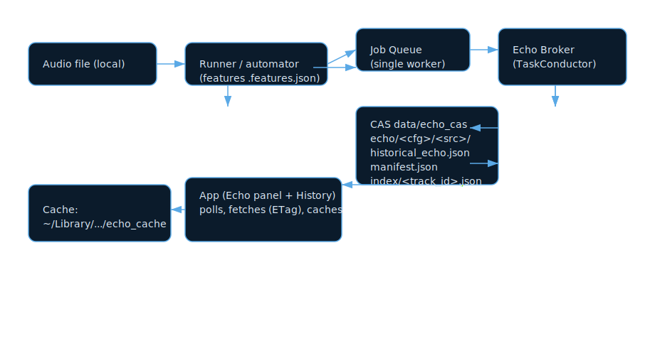

# Historical Echo Delivery (Runner → Broker → CAS → App)

## High-level data flow

```text
┌─────────────┐        ┌─────────────┐           ┌────────────┐           ┌─────────–─────┐
│ Audio file  │  →  │  │  Runner /   │           │  Echo      │           │   CAS (hash   │
│ (local)     │     │  │  automator  │           │  Broker    │           │   addressed)  │
└─────────────┘     │  │  (features) │           │ (TaskCond) │           └──────–────────┘
                    │  └─────────────┘           └────────────┘                  │
                    │           │ submit /echo/jobs                              │
                    │           ↓ validate, hash, schema                         │
                    │     ┌─────────────┐   writes immutable paths               │
                    └──→  │ Job Queue   │    ┌───────────────────────────–─┐     │
                          │ (single     │    │ echo/<cfg>/<src>/           │     │
                          │  worker)    │    │   historical_echo.json      │◀────┘
                          └─────────────┘    │   manifest.json             │
                                             │ echo/index/<track_id>.json  │
                                             └────────────────────────────–┘
                                                           │
                                                           │ fetch (ETag)
                                                           ▼
                                     ┌─────────────────────────────┐
                                     │ App (Echo panel + History)  │
                                     │  - polls job, fetches/caches│
                                     │  - shows status/neighbors   │
                                     │  - cache: ~/Library/...     │
                                     └─────────────────────────────┘
```

### Mermaid (editable source)

```mermaid
flowchart LR
    A[Audio file (local)] --> B[Runner / automator (features .features.json)]
    B --> Q[Job Queue (single worker)]
    Q -->|submit /echo/jobs| C[Echo Broker (TaskConductor)]
    C -->|validate + schema/hash<br/>write immutable| D[CAS data/echo_cas]
    D -->|"echo/<cfg>/<src>/historical_echo.json"<br>"echo/<cfg>/<src>/manifest.json"<br>"echo/index/<track_id>.json"| C
    C -->|fetch (ETag)| E[App: Echo panel + History]
    E -->|cache| F[~/Library/Application Support/.../echo_cache/<track>_historical_echo.json]
```

### SVG (pre-rendered)



## Separation of concerns

- **Runner / queue / automator**: produce features; do not hash or serve.
- **Broker (tools/task_conductor/echo_broker.py)**:
  - Accepts `features_path`, validates schema/hashes, writes immutable CAS paths, serves ETag.
  - Exposes: `POST /echo/jobs`, `GET /echo/jobs/{id}`, `GET /echo/{cfg}/{src}/historical_echo.json`, `GET /echo/index/{track_id}.json`.
- **CAS**: content-addressed storage rooted at `data/echo_cas`; immutable by config_hash/source_hash.
- **App client**:
  - Submits jobs when queue jobs finish.
  - Polls broker, fetches artifact with ETag, caches locally.
  - Displays status + neighbors/decades and allows retry fetch/submit.
- **History view**: “View Echo” triggers a fetch for past runs without rerun.

## Key paths and artifacts

- CAS: `data/echo_cas/echo/<config_hash>/<source_hash>/historical_echo.json` + `manifest.json`.
- Index: `data/echo_cas/echo/index/<track_id>.json` (latest pointer).
- App cache (real home): `~/Library/Application Support/MusicAdvisorMacApp/echo_cache/<track>_historical_echo.json`.
- Sandbox cache (when MA_APP_USE_REAL_HOME not set): `hosts/macos_app/build/home/Library/Application Support/MusicAdvisorMacApp/echo_cache/...`.

## Environment flags (app)

- `MA_ECHO_BROKER_ENABLE=1`
- `MA_ECHO_BROKER_URL=http://127.0.0.1:8091`
- `REPO=/Users/keithhetrick/music-advisor`
- Optional: `MA_APP_USE_REAL_HOME=1` (use real HOME for cache so Finder can see it).

## UI affordances (Run tab)

- Echo card shows per-track status, hashes, neighbor count, decade summary, top neighbors (5).
- Controls: Copy path, Open cached JSON, View JSON (via broker), Retry fetch (spinner), Retry submit (if sidecar exists).
- Hide/Show toggle on the Echo card header.

## UI affordances (History tab)

- “View Echo” on the preview card triggers broker fetch for the selected track.

## Retry paths

- **Retry fetch**: refetch artifact (uses cached artifact URL or latest index, updates cache/state).
- **Retry submit**: resubmit to broker if a sidecar exists in the queue for that track.

## Notes on HOME vs sandbox

- Running with `MA_APP_USE_REAL_HOME=1` aligns the app’s cache with Finder (`~/Library/.../echo_cache`).
- Without it, the app uses a sandboxed HOME under `hosts/macos_app/build/home`; the Echo card will still work but cached files live there.
- The Echo panel displays the cache base path and warns if sandboxed HOME is in use.
